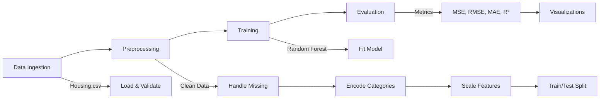

# 🏠 MLOps Pipeline - House Price Prediction (Local Version)

## 📋 Tổng Quan

Pipeline ML hoàn chỉnh để dự đoán giá nhà, chạy **100% LOCAL** - không cần Google Cloud Platform.

### ✨ Tính Năng

- ✅ **Modular Architecture**: 4 components độc lập (Ingestion → Preprocessing → Training → Evaluation)
- ✅ **Local Execution**: Chạy trực tiếp trên máy tính hoặc trong Docker
- ✅ **No Cloud Dependencies**: Không cần GCP, AWS, hay cloud nào khác
- ✅ **Comprehensive Metrics**: MSE, RMSE, MAE, R², MAPE
- ✅ **Visualizations**: Plots tự động (Actual vs Predicted, Residuals, Feature Importance)
- ✅ **Easy Configuration**: Environment variables qua `.env` file

---

## 🚀 Quick Start

### Option 1: Chạy Trực Tiếp với Python

# 1. Cài dependencies
pip install -r requirements.txt

# 2. Đảm bảo có dataset
# Đặt Housing.csv vào data/
# Cách 1: Docker Compose
docker-compose up

# Cách 2: Docker CLI
docker build -t mlops-pipeline .
docker run --rm -v %cd%/data:/app/data:ro -v %cd%/output:/app/output mlops-pipeline

---

## 📁 Cấu Trúc Project

```
MLOps/
├── 📂 data/                    # Dataset directory
│   └── Housing.csv             # Input dataset
│
├── 📂 src/                     # Pipeline components (modular)
│   ├── data_ingestion.py       # Load data
│   ├── preprocessing.py        # Clean, transform, split
│   ├── training.py             # Train Random Forest
│   ├── evaluation.py           # Evaluate & visualize
│   └── __init__.py             # Package exports
│
├── 📂 output/                  # Results (auto-generated)
│   ├── models/
│   │   └── model.pkl           # Trained model
│   ├── metrics/
│   │   └── metrics_*.json      # Evaluation metrics
│   ├── artifacts/
│   │   ├── scaler.pkl          # Feature scaler
│   │   ├── predictions.csv     # Predictions
│   │   └── feature_importance.json
│   └── plots/
│       └── evaluation_plots.png # Visualizations
│
├── 🐳 Dockerfile               # Docker image definition
├── 🐳 docker-compose.yml       # Docker Compose config
│
├── ⚙️ .env.example             # Configuration template
├── 📦 requirements.txt         # Python dependencies
│
└── 📖 README.md                # This file
```

---

## ⚙️ Cấu Hình

### Environment Variables (`.env`)

```bash
# Model hyperparameters
N_ESTIMATORS=100        # Number of trees
MAX_DEPTH=10            # Tree depth
RANDOM_STATE=42         # Random seed

# Data split
TEST_SIZE=0.2           # 20% for testing
```

**Tùy chỉnh:**
```bash
# Train với model mạnh hơn
N_ESTIMATORS=200
MAX_DEPTH=15
```

---

## 📊 Pipeline Workflow



### Step-by-Step

**1. Data Ingestion**
- Load `Housing.csv` từ `data/`
- Validate dataset (shape, columns, missing values)

**2. Preprocessing**
- Fill missing values (median for numerics)
- Encode categorical variables (label encoding)
- Split train/test (80/20)
- Scale features (StandardScaler)

**3. Training**
- Train Random Forest Regressor
- Hyperparameters từ `.env`
- Log training metrics

**4. Evaluation**
- Calculate metrics: MSE, RMSE, MAE, R², MAPE
- Generate plots:
  - Actual vs Predicted
  - Residual plot
  - Feature importance
  - Residual distribution
- Save all results to `output/`

---

## 📈 Kết Quả Output

### Metrics JSON
```json
{
  "mse": 1234.56,
  "rmse": 35.13,
  "mae": 25.42,
  "r2_score": 0.8523,
  "mape": 12.34
}
```

### Predictions CSV
```csv
actual,predicted,error,absolute_error,percentage_error
450000,445000,5000,5000,1.11
520000,518000,2000,2000,0.38
...
```

### Visualizations
- `evaluation_plots.png`: 4 plots in 1 figure
  - Actual vs Predicted scatter
  - Residual plot
  - Top 10 feature importance
  - Residual distribution

---

## 🔧 Advanced Usage

### 1. Customize Hyperparameters

**Via `.env`:**
```bash
N_ESTIMATORS=500
MAX_DEPTH=20
MIN_SAMPLES_SPLIT=5
```

**Via Docker:**
```bash
docker run -e N_ESTIMATORS=200 -e MAX_DEPTH=15 mlops-pipeline
```

### 2. Use as Python Module

```python
from src import data_ingestion, preprocessing, training, evaluation

# Load data
df = data_ingestion('data/Housing.csv')

# Preprocess
X_train, X_test, y_train, y_test, scaler = preprocessing(df)

# Train
model = training(X_train, y_train, {'n_estimators': 100, 'max_depth': 10})

# Evaluate
metrics = evaluation(model, X_test, y_test, output_dir='output/plots')
```

### 3. Load Trained Model

```python
import pickle

# Load model
with open('output/models/model.pkl', 'rb') as f:
    model = pickle.load(f)

# Load scaler
with open('output/artifacts/scaler.pkl', 'rb') as f:
    scaler = pickle.load(f)

# Predict on new data
new_data_scaled = scaler.transform(new_data)
predictions = model.predict(new_data_scaled)
```

---

## 🐳 Docker

### Build Image
```bash
docker build -t mlops-pipeline:latest .
```

### Run Container
```bash
docker run --rm \
  -v %cd%/data:/app/data:ro \
  -v %cd%/output:/app/output \
  -e N_ESTIMATORS=200 \
  mlops-pipeline:latest
```

### Docker Compose
```bash
# Start
docker-compose up

# Run in background
docker-compose up -d

# View logs
docker-compose logs -f

# Stop
docker-compose down
```

Xem chi tiết: [DOCKER_GUIDE.md](DOCKER_GUIDE.md)

---

## 📚 Dependencies

### Core ML
- `pandas` - Data manipulation
- `numpy` - Numerical computing
- `scikit-learn` - ML algorithms & metrics

### Visualization
- `matplotlib` - Plotting
- `seaborn` - Statistical visualizations

### Utilities
- `python-dotenv` - Environment variables

**Tổng dung lượng:** ~150MB (với Docker image `python:3.9-slim`)

---

## ❓ Troubleshooting

### ❌ "Dataset not found"
```bash
# Giải pháp 1: Download sample dataset
python download_dataset.py

# Giải pháp 2: Copy file của bạn
mkdir data
copy path\to\Housing.csv data\
```

### ❌ "Module not found: src"
```bash
# Đảm bảo chạy từ project root
cd path\to\MLOps
python run_pipeline.py
```

### ❌ Docker errors
```bash
# Kiểm tra Docker đang chạy
docker info

# Rebuild image (no cache)
docker-compose build --no-cache
```

### ❌ Low R² score
```bash
# Tăng complexity của model
N_ESTIMATORS=200
MAX_DEPTH=15

# Hoặc check data quality (missing values, outliers)
```

---

## 🔄 Development Workflow

### 1. Modify Code
```bash
# Sửa components trong src/
vi src/training.py

# Hoặc sửa main pipeline
vi run_pipeline.py
```

### 2. Test Locally
```bash
python run_pipeline.py
```

### 3. Rebuild Docker (nếu cần)
```bash
docker-compose build
docker-compose up
```

### 4. Check Results
```bash
# Xem metrics
cat output/metrics/metrics_*.json

# Xem plots
start output/plots/evaluation_plots.png
```

---

## 🎯 Performance Tips

### 1. Faster Training
```bash
# Giảm số trees (trade-off: accuracy)
N_ESTIMATORS=50
MAX_DEPTH=8
```

### 2. Better Accuracy
```bash
# Tăng complexity
N_ESTIMATORS=200
MAX_DEPTH=15

# Fine-tune advanced params
MIN_SAMPLES_SPLIT=5
MIN_SAMPLES_LEAF=2
```

### 3. Memory Optimization
- Sử dụng smaller dataset cho testing
- Reduce `N_ESTIMATORS` nếu RAM thấp
- Close plots sau khi save trong evaluation

---

## 📖 Documentation

- **Main README**: This file
- **Docker Guide**: [DOCKER_GUIDE.md](DOCKER_GUIDE.md)
- **Setup Guide**: [SETUP.md](SETUP.md) (for GCP version - reference only)

---

## ✅ Checklist

### Before Running
- [ ] Python 3.9+ installed (hoặc Docker Desktop)
- [ ] `Housing.csv` trong `data/`
- [ ] Dependencies installed (`pip install -r requirements.txt`)

### After Running
- [ ] Check `output/models/model.pkl` exists
- [ ] Review `output/metrics/*.json`
- [ ] View `output/plots/evaluation_plots.png`
- [ ] Check `output/artifacts/predictions.csv`

---

## 🤝 Contributing

1. Fork the repository
2. Create feature branch (`git checkout -b feature/AmazingFeature`)
3. Commit changes (`git commit -m 'Add AmazingFeature'`)
4. Push to branch (`git push origin feature/AmazingFeature`)
5. Open Pull Request

---

## 📄 License

MIT License - feel free to use and modify

---

## 👥 Authors

MLOps Team

---

**🚀 Get Started:** `python run_pipeline.py` hoặc `run_docker.bat`
