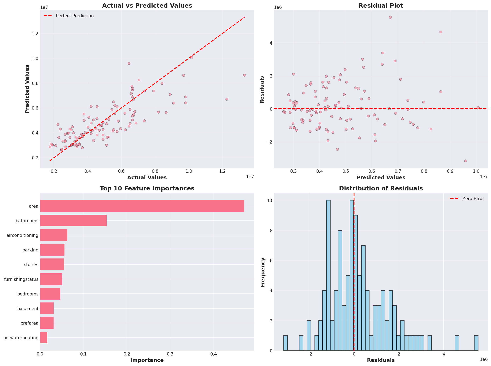
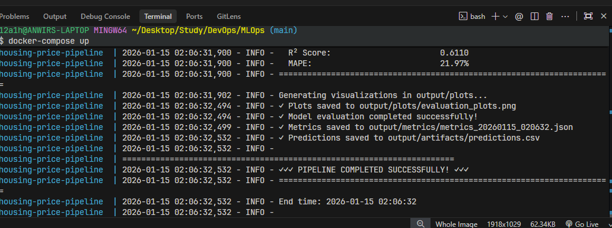
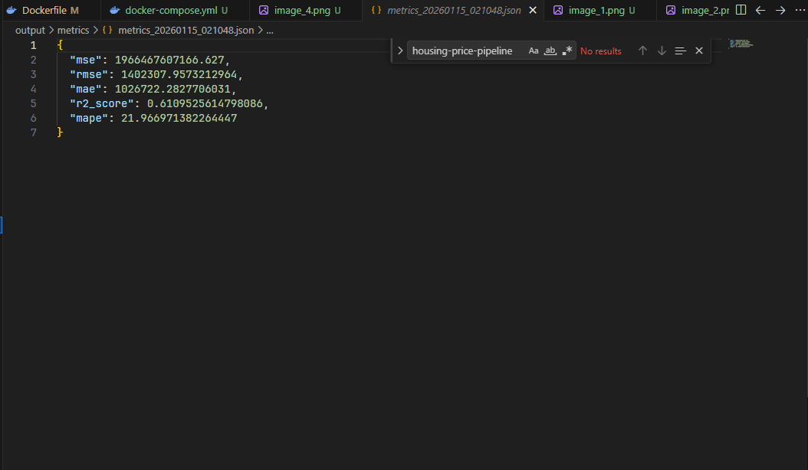
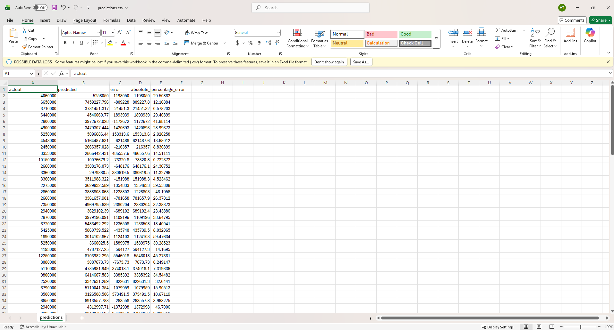
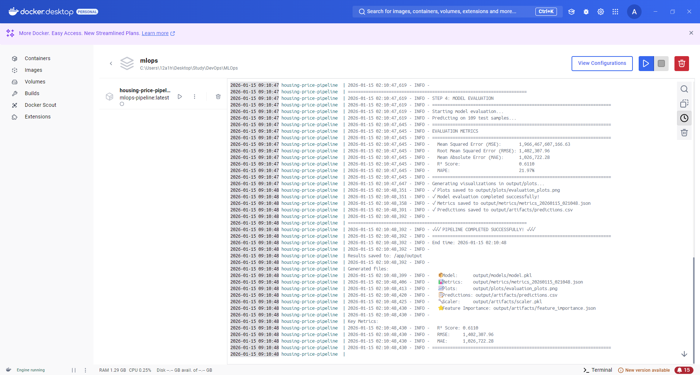

# 🏠 MLOps Pipeline - House Price Prediction (Local Version)

> **Sinh Viên thực hiện**: Huỳnh Tấn Lộc - **MSSV**: 22120186  
> **Tự đánh giá mức độ hoàn thành**: 10/10 🌟

## 📋 Tổng Quan

Dự án này là một **MLOps Pipeline** hoàn chỉnh để dự đoán giá nhà (Regression Task), được thiết kế để chạy ở local mà không phụ thuộc vào nền tảng đám mây.

Dự án minh họa quy trình từ lúc nhận dữ liệu thô đến khi có được mô hình dự đoán và báo cáo đánh giá chi tiết, tuân thủ các nguyên tắc thiết kế **Modular** và **Reproducible**.

---

## 💾 1. Thông Tin Dữ Liệu (Dataset)

Dữ liệu được sử dụng là **Housing.csv**, chứa thông tin về các ngôi nhà và giá bán của chúng.

### Cấu trúc dữ liệu
Dataset bao gồm 545 dòng và 13 cột:

| Tên Cột | Loại Dữ Liệu | Mô Tả | Ví dụ Giá Trị |
|---------|--------------|-------|---------------|
| **price** | Numerical | **[Target]** Giá nhà (biến mục tiêu) | 13,300,000 |
| **area** | Numerical | Diện tích nhà (sq ft) | 7420 |
| **bedrooms** | Numerical | Số phòng ngủ | 4 |
| **bathrooms** | Numerical | Số phòng tắm | 2 |
| **stories** | Numerical | Số tầng | 3 |
| **mainroad** | Categorical | Nhà mặt tiền đường chính? | yes/no |
| **guestroom** | Categorical | Có phòng khách? | yes/no |
| **basement** | Categorical | Có tầng hầm? | yes/no |
| **hotwaterheating**| Categorical | Có bình nước nóng? | yes/no |
| **airconditioning**| Categorical | Có điều hòa? | yes/no |
| **parking** | Numerical | Số chỗ đậu xe | 2 |
| **prefarea** | Categorical | Khu vực ưu tiên? | yes/no |
| **furnishingstatus**| Categorical | Tình trạng nội thất | furnished/semi-furnished/unfurnished |

---

## ⚙️ 2. Quy Trình Tiền Xử Lý (Preprocessing)

Pipeline thực hiện các bước xử lý dữ liệu tự động trong `src/preprocessing.py`:

### 2.1. Xử lý Missing Values (Giá trị thiếu)
- Kiểm tra toàn bộ dataset để tìm giá trị null.
- **Chiến lược**: Điền các giá trị thiếu ở các cột số (`Numerical`) bằng giá trị **Trung vị (Median)** của cột đó để tránh ảnh hưởng của outliers.

### 2.2. Mã hóa dữ liệu (Categorical Encoding)
- Các biến phân loại (text) như `yes/no` hoặc `furnished` không thể đưa trực tiếp vào mô hình toán học.
- **Chiến lược**: Sử dụng **Label Encoding**.
    - Ví dụ: `no` -> `0`, `yes` -> `1`.
    - `unfurnished` -> `0`, `semi-furnished` -> `1`, `furnished` -> `2`.

### 2.3. Phân chia Train/Test
- Dữ liệu được chia tách để đảm bảo mô hình được đánh giá khách quan.
- **Tỷ lệ**: 80% Training - 20% Testing.
- **Random State**: 42 (đảm bảo kết quả có thể lặp lại).

### 2.4. Chuẩn hóa dữ liệu (Feature Scaling)
- Các đặc trưng như `area` (hàng nghìn) và `stories` (hàng đơn vị) có sự chênh lệch lớn về độ lớn, có thể làm lệch mô hình.
- **Chiến lược**: Sử dụng **StandardScaler** (Z-score normalization).
    - Công thức: $z = \frac{x - \mu}{\sigma}$
    - Dữ liệu sẽ được đưa về dạng phân phối chuẩn với mean = 0 và std = 1.
    - **Lưu ý**: Scaler được `fit` trên tập Train và chỉ `transform` trên tập Test để tránh rò rỉ dữ liệu (Data Leakage).

---

## 🧠 3. Mô Hình & Hyperparameters

### Mô hình sử dụng
**Random Forest Regressor** (Rừng ngẫu nhiên) được chọn vì khả năng xử lý tốt cả dữ liệu số và phân loại, cũng như khả năng chống lại overfitting tốt hơn Decision Tree đơn lẻ.

### Giải thích Hyperparameters (Siêu tham số)
Các tham số này được cấu hình trong file `.env` hoặc mặc định trong code:

| Tham Số | Giá Trị Mặc Định | Giải Thích | Tác Động |
|---------|------------------|------------|----------|
| **n_estimators** | 100 | Số lượng cây quyết định (Decision Trees) trong rừng. | Càng nhiều cây mô hình càng ổn định nhưng chạy lâu hơn. |
| **max_depth** | 10 | Độ sâu tối đa của mỗi cây. | Giới hạn độ phức tạp. Quá sâu dễ gây Overfitting, quá nông gây Underfitting. |
| **min_samples_split**| 2 | Số mẫu tối thiểu cần có để chia tách một nút (node). | Ngăn cây chia nhỏ quá mức chi tiết (chống Overfitting). |
| **min_samples_leaf** | 1 | Số mẫu tối thiểu phải có ở một nút lá (leaf node). | Đảm bảo mỗi lá có đủ dữ liệu đại diện. |
| **random_state** | 42 | Hạt giống ngẫu nhiên. | Đảm bảo mỗi lần chạy đều ra kết quả giống hệt nhau. |

---

## 📊 4. Đánh Giá (Evaluation)

Hệ thống sử dụng bộ 5 chỉ số toàn diện để đánh giá hiệu quả dự đoán trên tập Test:

1.  **MSE (Mean Squared Error)**: Trung bình bình phương sai số. Phạt nặng các dự đoán sai lệch lớn.
2.  **RMSE (Root Mean Squared Error)**: Căn bậc hai của MSE. Đơn vị cùng với đơn vị của giá nhà, dễ hình dung sai số thực tế.
3.  **MAE (Mean Absolute Error)**: Trung bình sai số tuyệt đối. Cho biết sai số trung bình là bao nhiêu tiền.
4.  **R² Score**: Độ phù hợp của mô hình.
    - Giá trị càng gần 1 (100%) càng tốt.
    - Cho biết mô hình giải thích được bao nhiêu % sự biến thiên của dữ liệu.
5.  **MAPE (Mean Absolute Percentage Error)**: Sai số phần trăm trung bình.
    - Ví dụ: 10% nghĩa là dự đoán lệch khoảng 10% so với giá thực.

### Biểu đồ trực quan hóa
Pipeline tự động sinh ra các biểu đồ trong thư mục `output/plots`:



1.  **Actual vs Predicted**: So sánh giá thực tế và giá dự đoán. Các điểm càng gần đường chéo đỏ càng tốt.
2.  **Residual Plot**: Phân bố phần dư (sai số). Nếu phân bố ngẫu nhiên quanh trục 0 là tốt.
3.  **Feature Importance**: Top các yếu tố ảnh hưởng nhất đến giá nhà (Ví dụ: `area`, `bathrooms` thường quan trọng nhất).
4.  **Distribution of Residuals**: Histogram của sai số, nên có dạng hình chuông (Phân phối chuẩn) tập trung quanh 0.

---

## 🖼️ Minh Họa Kết Quả

### 1. Terminal Output
Quá trình chạy pipeline hiển thị log chi tiết từng bước:


### 2. File Kết Quả (Metrics & Predictions)
Kết quả đánh giá và file dự đoán chi tiết được lưu tự động:



### 3. Docker Management
Dễ dàng quản lý container thông qua Docker Desktop:


---

## 🚀 Hướng Dẫn Chạy (Quick Start)

### Cách 1: Chạy với Python (Khuyên dùng đẻ Dev)
```bash
# 1. Cài đặt thư viện
pip install -r requirements.txt

# 2. Chạy pipeline
python run_pipeline.py
```

### Cách 2: Chạy với Docker (Khuyên dùng để Deploy)
```bash
# Build và chạy
docker-compose up
```

## 📁 Cấu Trúc Thư Mục Output
Sau khi chạy xong, thư mục `output/` sẽ chứa:
- `models/model.pkl`: Mô hình đã train.
- `metrics/metrics_*.json`: File chứa chỉ số MSE, R2...
- `plots/evaluation_plots.png`: Biểu đồ đánh giá.
- `artifacts/scaler.pkl`: Bộ chuẩn hóa dữ liệu (cần thiết để dự đoán data mới).
- `artifacts/predictions.csv`: File CSV chứa kết quả so sánh giá thực vs dự đoán.
